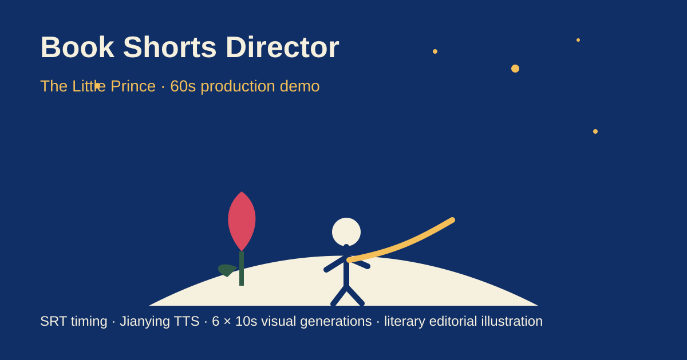

<p align="center">
  
</p>

<h1 align="center">Book Shorts Director</h1>

<p align="center"><strong>把一本书，变成可以直接制作的中文文学短视频。</strong></p>

<p align="center">叙事策划 · 专属文学插画 · SRT 精确停顿 · 剪映 TTS · 固定 10 秒 AI 视频分镜</p>

<p align="center">
  
  
  
  
</p>

## 🎬 真实成片 Demo

<p align="center">
  <a href="demo/little-prince-demo-web.mp4">
    
  </a>
</p>

<p align="center"><strong>点击上方预览图，播放完整 60 秒《小王子》成片</strong></p>

[直接打开 MP4](demo/little-prince-demo-web.mp4) · [查看完整制作案例](examples/the-little-prince/)

<!-- INLINE_GITHUB_VIDEO_ATTACHMENT_URL -->

这个 Demo 不是概念稿。它实际使用了本项目的完整流程：6 个固定 10 秒视频片段、18 个 SRT/TTS 字幕块、真实时间空白控制朗读停顿，以及为《小王子》单独设计的深钴蓝、暖金、玫瑰红文学编辑插画体系。

## 这个项目解决什么问题

很多 AI 读书视频的流程是分裂的：先写稿，再配音，再随手找画面，最后才想办法把它们拼在一起。结果常见三个问题：旁白和画面不同步，TTS 没有自然停顿，固定时长的视频生成片段很难衔接。

Book Shorts Director 把这些环节放进同一条生产时间轴：


核心思想很简单：**SRT 是时间主控，10 秒是视频生产容器，书籍专属视觉体系负责让每一期真正像“为这本书设计的”。**

## ✨ 核心能力

| 能力 | 做什么 |
|---|---|
| 叙事导演 | 只有书名时先给 3 个方向，避免一分钟讲完整本书 |
| 可变时长 | 默认 60 秒，同时支持 30、90、120 秒和自定义时长 |
| SRT 节奏 | 用字幕块之间的真实空白控制停顿，而不是赌 TTS 会不会读出停顿 |
| 剪映 TTS | 导入 SRT 后批量朗读，同一音色贯穿全片 |
| 文学视觉 | 默认现代文学编辑插画，每本书都有独立色板、人物、场景和意象 |
| 固定视频容器 | 每个 AI 视频片段固定 10 秒，适合 Omni 类固定时长工作流 |
| 连续转场 | 每一段末帧都为下一段设计明确的 Match Cut 或视觉接口 |
| 原著约束 | 优先转述，避免伪造名句、剧情、人物动机和不必要剧透 |
| 生产交付 | 最终输出 SRT、视频 Prompt、BGM、SFX、转场和剪映拼接说明 |

## ⏱️ 时长模式

| 成片时长 | 10 秒视频容器 | 推荐用途 |
|---|---:|---|
| 30 秒 | 3 | 一个金句、观点或情绪转折 |
| 60 秒 | 6 | 默认，节奏最均衡 |
| 90 秒 | 9 | 更完整的人物、关系或剧情弧线 |
| 120 秒 | 12 | 更充分的文学解读 |
| 自定义 | `ceil(秒数 / 10)` | 最后一段在目标时间点裁尾 |

例如 45 秒版本会规划 5 个固定 10 秒片段。旁白和 SRT 在 45 秒前结束，第 5 段的 45 到 50 秒作为可裁掉尾部。

详细规则见 [时长模式](docs/duration-presets.md)。

## 🎨 默认视觉：文学编辑插画动画

这个 Skill 已经脱离传统火柴人风格。默认画面更接近高级书籍插画、文学杂志插图和动态书封：

- 干净二维线稿与分离平涂色块
- 年龄合适、简化但有设计感的人物
- 大量负空间和手机竖屏可读构图
- 克制的推镜、跟拍、视差、形状匹配和前景擦拭
- 每本书独立色板、专属环境、人物轮廓和反复出现的意象
- 月亮、动物、建筑、海洋和植物与人物保持同一种插画语言
- 默认避免摄影月球、图库纹理、写实 AI 人脸、脏灰滤镜和无关 3D 物件

《小王子》可以是深钴蓝、暖星金、玫瑰红、小星球、玫瑰、狐狸、麦田和星星。《局外人》会重新建立烈日、沙色、黑和炽热橙的系统，不机械复制上一期。

详细规则见 [视觉系统](docs/visual-system.md)。

## 🎙️ 为什么用 SRT 控制 TTS

SRT 条目之间的空白是真实时间，因此它可以直接变成朗读停顿。

```text
00:00:00,300 --> 00:00:02,800
世界上有那么多玫瑰，

00:00:03,500 --> 00:00:06,200
为什么只有一朵，

00:00:06,800 --> 00:00:08,900
让小王子一直放不下？
```

这里的 0.7 秒和 0.6 秒空白会变成真正的停顿。这样旁白、字幕和镜头从一开始就在同一条时间轴上。

完整操作见 [剪映 SRT 工作流](docs/srt-jianying.md)。

## 🚀 快速开始

最简单的输入只有一句：

```text
用《小王子》做一期。
```

Skill 会先给出 3 个叙事方向。用户选择后输出 Phase A 导演预案，确认后再生成精确 SRT 和每个 10 秒容器的生产级英文视频 Prompt。

也可以直接指定条件：

```text
用《局外人》做 30 秒，重点讲太阳和荒诞。
```

```text
把《百年孤独》做成 90 秒，围绕黄色蝴蝶这个意象。
```

```text
做 45 秒版本，剪映 SRT 控制停顿，视觉用文学编辑插画。
```

## 📦 Skill 源码

Skill 位于：

[`skill/directing-book-shorts`](skill/directing-book-shorts/)

仓库同时提供打包后的 `skill.zip`，便于直接导入支持 Skills 的环境。

## 🧪 已验证案例：《小王子》

案例主题：**世界上有那么多玫瑰，为什么只有一朵会变得不可替代？**

生产包包含：

- 60 秒成片
- 6 个固定 10 秒视觉片段
- 18 个 SRT/TTS 字幕块
- 《小王子》专属文学插画视觉体系
- 逐段转场与 SFX 设计
- 可直接导入剪映的字幕文件

查看 [完整案例目录](examples/the-little-prince/)。

## 🗂️ 项目结构

```text
book-shorts-director-skill/
├── README.md
├── skill/directing-book-shorts/   # ChatGPT Skill 本体
├── docs/                          # 中文工作流与设计文档
├── examples/the-little-prince/    # 完整生产案例
├── demo/                          # 成片与首页预览
├── ROADMAP.md                     # 后续计划
├── CHANGELOG.md                   # 版本变化
└── LICENSE
```

详细说明见 [项目架构](docs/project-architecture.md)。

## 🧭 项目原则

**先选一个值得讲的问题，再决定讲多少。** 时长越长，增加的是故事细节和情绪层次，不是主题数量。

**每本书都应该拥有自己的视觉世界。** 账号需要统一气质，但不能让所有书都长成同一支模板视频。

**旁白节奏要能被编辑器执行。** 停顿写在时间轴里，不只写在标点里。

**AI 负责执行，导演规则负责一致性。** 人物、场景、色板、道具、转场和声音都需要提前锁定。

## 🛣️ Roadmap

下一阶段包括更多真实案例、自动生成项目文件夹、角色与视觉连续性检查、更多 TTS 后端，以及针对不同视频模型的 Prompt Adapter。

查看 [ROADMAP](ROADMAP.md)。

## 📖 文档

- [完整工作流](docs/workflow.md)
- [时长模式](docs/duration-presets.md)
- [文学视觉系统](docs/visual-system.md)
- [剪映 SRT 与 TTS](docs/srt-jianying.md)
- [项目架构](docs/project-architecture.md)
- [GitHub About 推荐文案](docs/github-about.md)

## 🤝 贡献

欢迎增加新的真实案例、视觉体系、字幕节奏模板和模型适配。提交前请阅读 [CONTRIBUTING.md](CONTRIBUTING.md)。

## License

MIT。项目中的 Demo 和案例用于展示工作流。原著、译本、商标，以及第三方视频生成和 TTS 平台相关权利仍归各自权利人所有。
